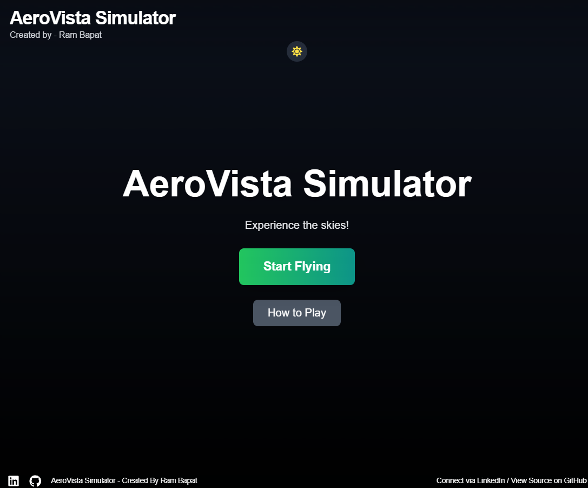
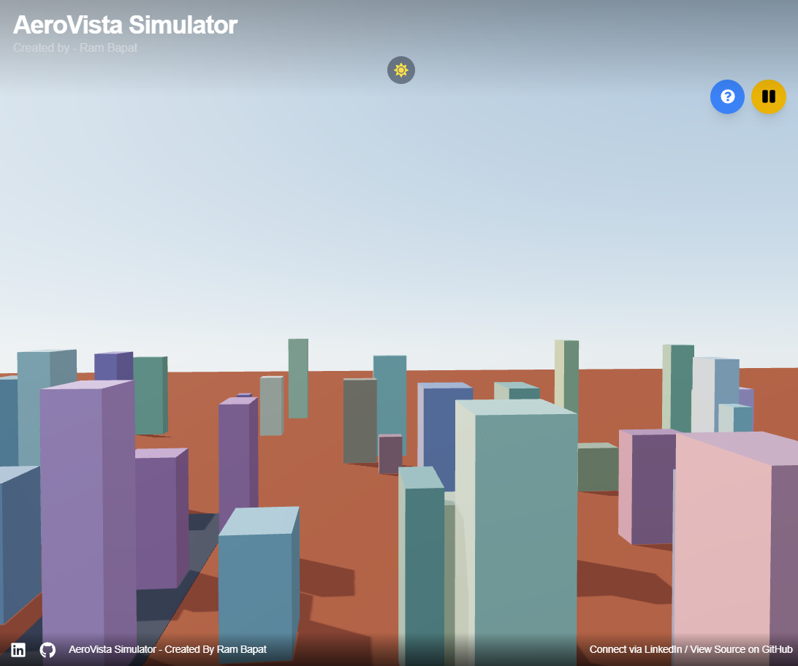
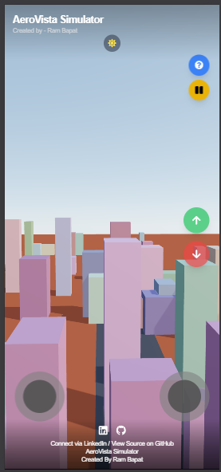
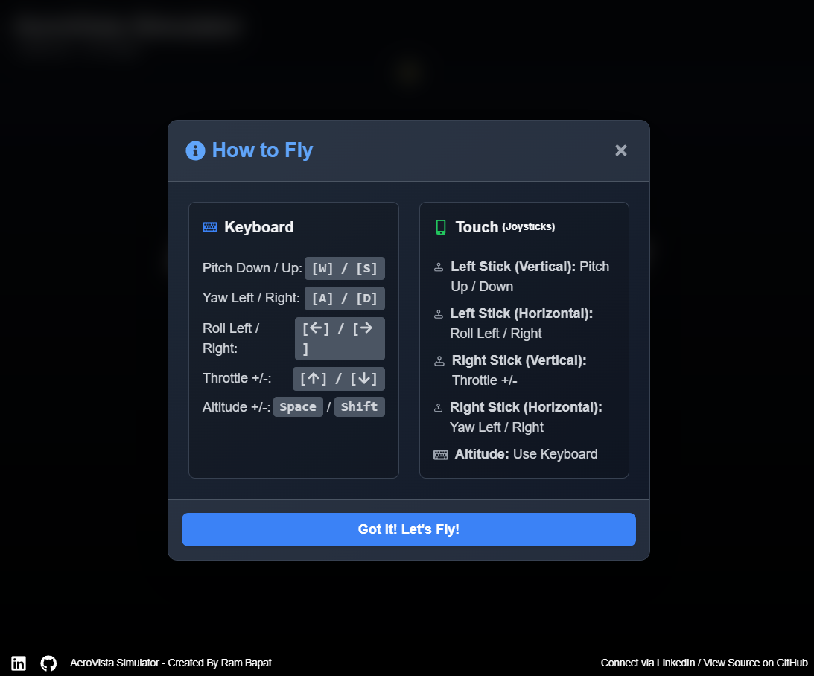

# AeroVista Flight Simulator ✨✈️🌆

## Try live demo - [Demo](https://aero-vista-flight-simulator.vercel.app/)

A web-based 3D flight simulator built with React, Three.js, and Vite, letting you pilot a plane through a stylized city environment using keyboard or touch controls. Developed with AI assistance as part of the #30DaysOfVibeCoding challenge.

<!-- ================================================== -->






<!-- ================================================== -->

## Overview

This project simulates the experience of flying an airplane over a simple, procedurally generated city. It features a 3D environment rendered using Three.js via the React Three Fiber library, providing an interactive way to explore the virtual skies.

Users are presented with a start screen, a pause menu, and a modal explaining the controls. The plane can be controlled using either keyboard inputs or on-screen touch controls (joysticks and dedicated buttons), making it accessible on both desktop and mobile devices. The interface also includes a dark/light theme toggle.

This project was built as part of a personal challenge, "30 Days of Vibe Coding," leveraging AI assistance for code generation, debugging, and concept refinement.

## Features

*   **Interactive 3D Environment:** Rendered with React Three Fiber & Drei, featuring sky, ground, and basic lighting/shadows.
*   **Airplane Control:** Fly a basic airplane model within the 3D space.
*   **Stylized Cityscape:** Includes a runway and procedurally generated buildings.
*   **Dual Control Schemes:**
    *   **Keyboard:** Comprehensive controls for Throttle, Pitch, Roll, Yaw, and Altitude.
    *   **Touch:** On-screen Joysticks for primary flight axes (Pitch, Roll, Yaw, Throttle) and dedicated buttons for Altitude adjustments.
*   **UI States & Navigation:**
    *   Clear Start Screen with options to begin or view controls.
    *   In-game Pause Menu with Resume, Restart, How-to-Play, and Main Menu options.
    *   Detailed "How to Play" Modal accessible from Start Screen, Pause Menu, and during gameplay.
*   **Theme Customization:** Dark/Light theme toggle, respecting user preference via localStorage.
*   **Responsive Design:** UI adapts to Desktop, Tablet, and Mobile viewports.
*   **Modern Tooling:** Built with Vite for a fast and efficient development workflow.
*   **Utility-First Styling:** Leverages Tailwind CSS for styling components.

## Tech Stack

*   **Frontend Framework:** React 18+
*   **Build Tool:** Vite
*   **3D Graphics:** Three.js
*   **React Renderer for Three.js:** React Three Fiber (`@react-three/fiber`)
*   **R3F Helpers/Abstractions:** Drei (`@react-three/drei`)
*   **Styling:** Tailwind CSS
*   **Touch Controls:** `react-joystick-component`
*   **Icons:** `react-icons`
*   **Language:** JavaScript (ES6+)
*   **Package Manager:** npm

## Getting Started

To get a local copy up and running, follow these simple steps.

### Prerequisites

*   Node.js (v18 or higher recommended, includes npm) installed on your system. Download from [nodejs.org](https://nodejs.org/).
*   Git (for cloning the repository).

### Installation & Setup

1.  **Clone the repository:**
    ```bash
    git clone https://github.com/Barrsum/AeroVista-Flight-Simulator.git
    ```

2.  **Navigate to the project directory:**
    ```bash
    cd AeroVista-Flight-Simulator
    ```

3.  **Install NPM packages:**
    ```bash
    npm install
    ```

### Running the Project

1.  **Start the development server:**
    ```bash
    npm run dev
    ```
    This command will start the Vite development server.

2.  **Open the application:**
    Open your web browser and navigate to the local URL provided by Vite (usually `http://localhost:5173/` or a similar port).

## Contributing

While this was primarily a personal challenge project, contributions, issues, and feature requests are welcome! Feel free to check the [issues page](https://github.com/Barrsum/AeroVista-Flight-Simulator/issues).

1.  Fork the Project
2.  Create your Feature Branch (`git checkout -b feature/AmazingFeature`)
3.  Commit your Changes (`git commit -m 'Add some AmazingFeature'`)
4.  Push to the Branch (`git push origin feature/AmazingFeature`)
5.  Open a Pull Request

## License

Distributed under the MIT License. See `LICENSE.md` (you may need to create this file, typically just containing standard MIT license text) for more information.

## Acknowledgements

*   **Core Libraries:** [React](https://react.dev/), [Vite](https://vitejs.dev/), [Three.js](https://threejs.org/)
*   **React Three Fiber Ecosystem:** [React Three Fiber](https://docs.pmnd.rs/react-three-fiber/), [Drei](https://github.com/pmndrs/drei)
*   **Styling:** [Tailwind CSS](https://tailwindcss.com/)
*   **UI Components:** [react-joystick-component](https://github.com/elipay/react-joystick-component), [React Icons](https://react-icons.github.io/react-icons/)

---

Built by Ram Bapat - Challenge [#30DaysOfVibeCoding](https://www.linkedin.com/posts/ram-bapat-barrsum-diamos_vibecoding-ai-machinelearning-activity-7312839191153860608-wQ8y?utm_source=share&utm_medium=member_desktop&rcm=ACoAAEokGUcBG1WEFP4A_IMlyO4LNl-eu2MD52w) - [LinkedIn Profile](https://www.linkedin.com/in/ram-bapat-barrsum-diamos)
